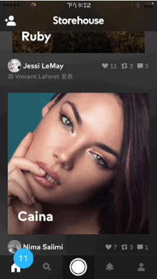
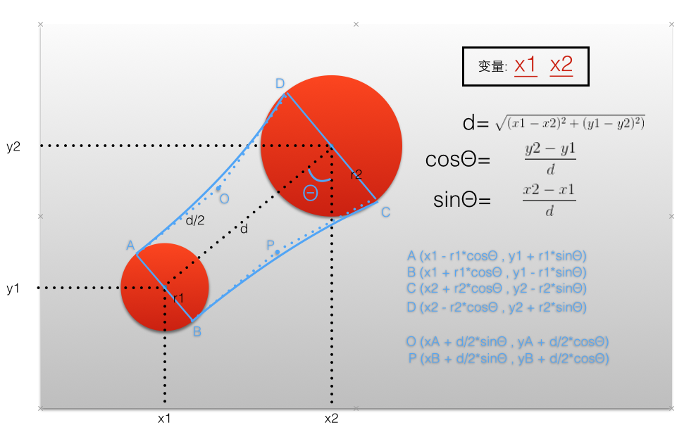

# KYCuteView
弹弹弹，就是这么Q弹带劲！

实现类似QQ消息拖拽消失的交互+GameCenter的浮动小球效果






###How to use
E!A!S!Y!

```
    KYCuteView *cuteView = [[KYCuteView alloc]initWithPoint:CGPointMake(25, 505) superView:self.view];
    cuteView.viscosity  = 20;
    cuteView.bubbleWidth = 35;
    cuteView.bubbleColor = [UIColor colorWithRed:0 green:0.722 blue:1 alpha:1];
    [cuteView setUp];
    [cuteView addGesture];
    
    //注意：设置 'bubbleLabel.text' 一定要放在 '-setUp' 方法之后
    //Tips:When you set the 'bubbleLabel.text',you must set it after '-setUp'
    cuteView.bubbleLabel.text = @"13";
```


###HERE IS THE PROPERTY
```
//父视图
//set the view which you wanna add the 'cuteBubble'
@property (nonatomic,weak)UIView *containerView;

//气泡上显示数字的label
//the label on the bubble
@property (nonatomic,strong)UILabel *bubbleLabel;

//气泡的直径
//bubble's diameter
@property (nonatomic,assign)CGFloat bubbleWidth;

//气泡粘性系数，越大可以拉得越长
//viscosity of the bubble,the bigger you set,the longer you drag
@property (nonatomic,assign)CGFloat viscosity;

//气泡颜色
//bubble's color
@property (nonatomic,strong)UIColor *bubbleColor;

//需要隐藏气泡时候可以使用这个属性：self.frontView.hidden = YES;
//if you wanna hidden the bubble, you can ’self.frontView.hidden = YES‘
@property (nonatomic,strong)UIView *frontView;

```

Intro: [http://kittenyang.com/drawablebubble/](http://kittenyang.com/drawablebubble/)

